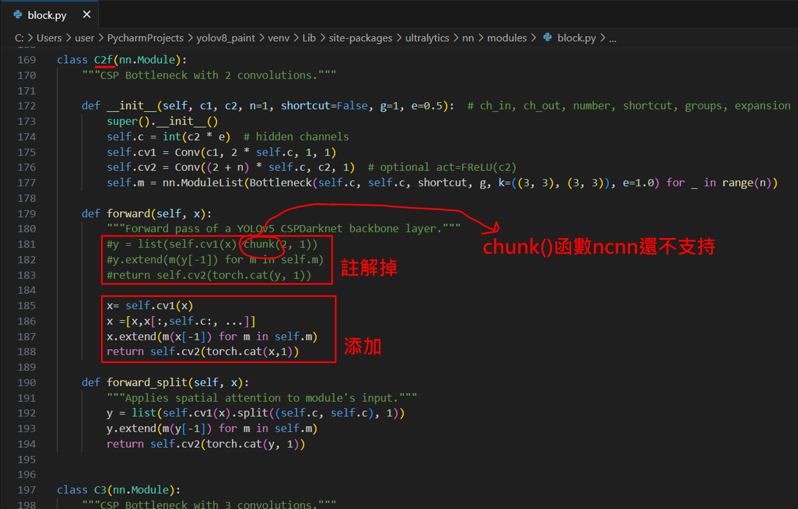
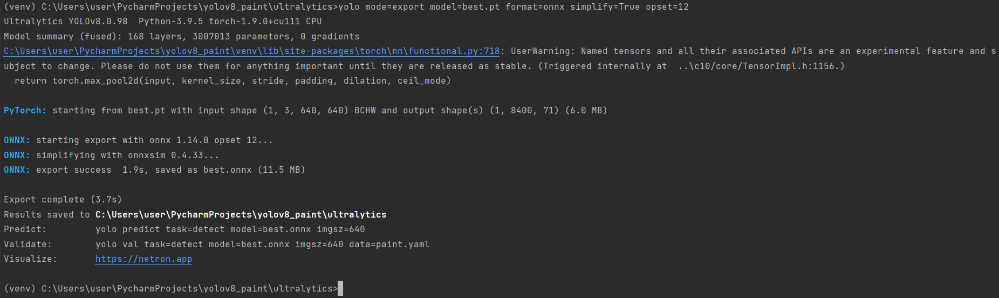
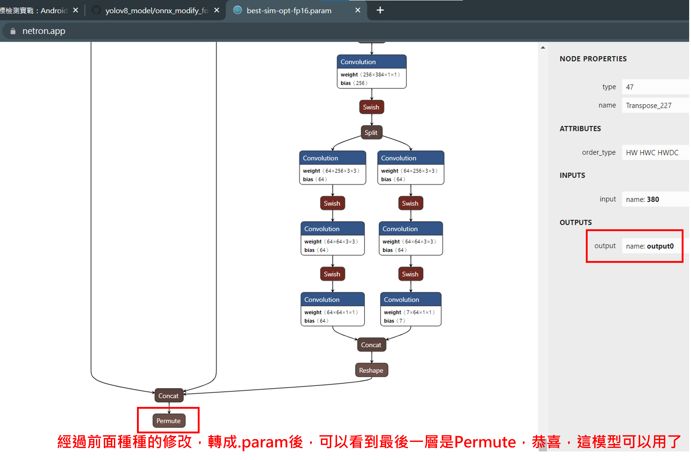
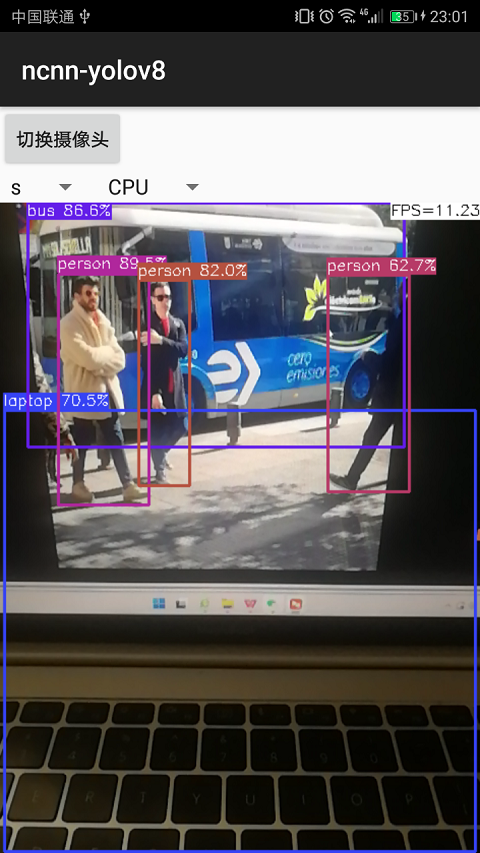

# 讓 .onnx 變成騰訊的形狀
## 修改 yolov8 官方檔案，因為有些函數 ncnn 還不支持
* ultralytics/nn/modules/block.py

* ultralytics/nn/modules/head.py

## .pt -> .onnx

## .onnx -> .param

# ncnn-android-yolov8

The yolov8 object detection

This is a sample ncnn android project, it depends on ncnn library and opencv

https://github.com/Tencent/ncnn

https://github.com/nihui/opencv-mobile

## how to build and run
### step1
https://github.com/Tencent/ncnn/releases

* Download ncnn-YYYYMMDD-android-vulkan.zip or build ncnn for android yourself
* Extract ncnn-YYYYMMDD-android-vulkan.zip into **app/src/main/jni** and change the **ncnn_DIR** path to yours in **app/src/main/jni/CMakeLists.txt**

### step2
https://github.com/nihui/opencv-mobile

* Download opencv-mobile-XYZ-android.zip
* Extract opencv-mobile-XYZ-android.zip into **app/src/main/jni** and change the **OpenCV_DIR** path to yours in **app/src/main/jni/CMakeLists.txt**

### step3
* Open this project with Android Studio, build it and enjoy!

## some notes
* Android ndk camera is used for best efficiency
* Crash may happen on very old devices for lacking HAL3 camera interface
* All models are manually modified to accept dynamic input shape
* Most small models run slower on GPU than on CPU, this is common
* FPS may be lower in dark environment because of longer camera exposure time

## screenshot

## Reference：  
https://github.com/nihui/ncnn-android-nanodet  
https://github.com/Tencent/ncnn  
https://github.com/ultralytics/assets/releases/tag/v0.0.0

## Download apk
* apk 下載網址：https://github.com/s1091845/yolov8ncnn/releases

