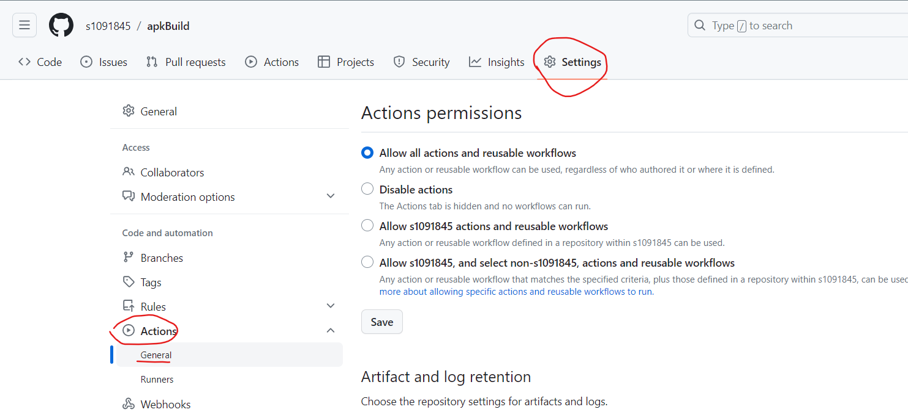
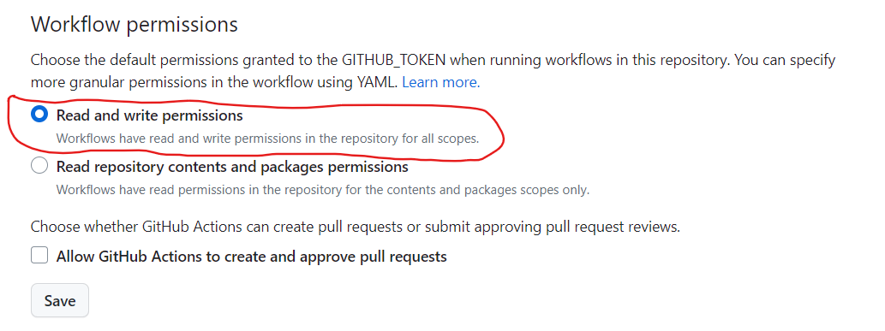

# Build and Release apk
## 自動化的方式打包（build）
* Use Github Actions!
* CI（Continuous Integration）

## Checkout Action
checkout action 是一個標準化的 action，如果你的工作流程中有下列 actions 的話，則需要先執行 checkout action：

* 你的工作流程需要先複製出一份專案程式碼，例如針對專案進行打包、測試，或者使用 CI 時。
* 在你的工作流程中，至少有一個 action 是定義在同一個 repository 內（而非引用自外部公開的 repository），參考 [Referencing actions in your workflow](https://docs.github.com/en/actions/using-workflows#referencing-actions-in-your-workflow)。

要使用標準的 checkout action 只需要在步驟中加入：

```python
- uses: actions/checkout@v3
```

https://pjchender.dev/devops/devops-github-action/

## token
在上一篇文章中有提到，若是要從外部觸發 workflow，需要有一個有足夠權限的 token，而這個 token 需要到開發者帳號的 settings >> Developer settings 頁面中取得。

但是，如果假設執行的環境已經在 action 內部了，那還需要申請這樣一個 token 嗎?

答案是不用的，只要透過 ${{ secrets.GITHUB_TOKEN }} 就可以取得一個合法的 token，而這 token 也正式代表了執行目前這個 action 的身份，而這個 token 具體有哪些權限，可以參考[官方文件的說明](https://docs.github.com/en/actions/security-guides/automatic-token-authentication#permissions-for-the-github_token)。

https://godleon.github.io/blog/DevOps/learn-GitHub-Action-2/




https://github.com/softprops/action-gh-release/issues/236

## softprops/action-gh-release@v1
https://github.com/softprops/action-gh-release/tree/v1

## actions/checkout@v3
https://github.com/actions/checkout